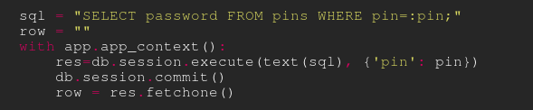
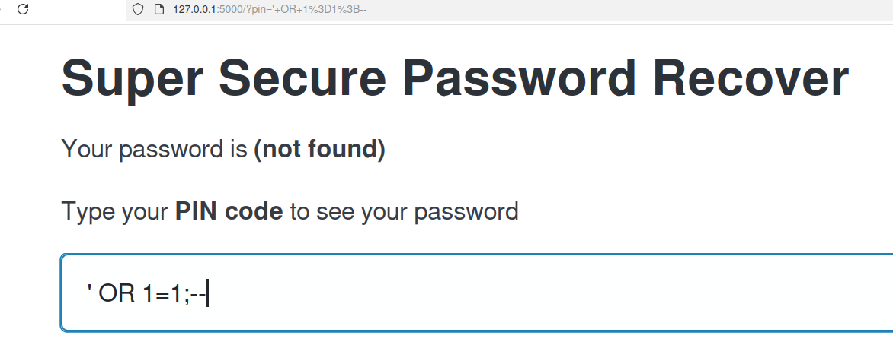
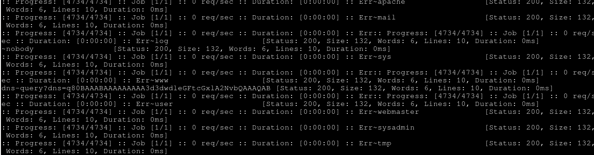
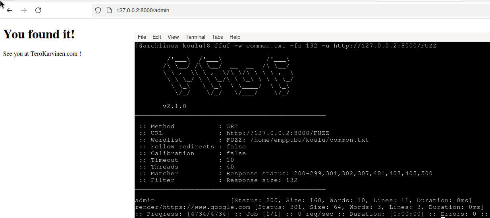
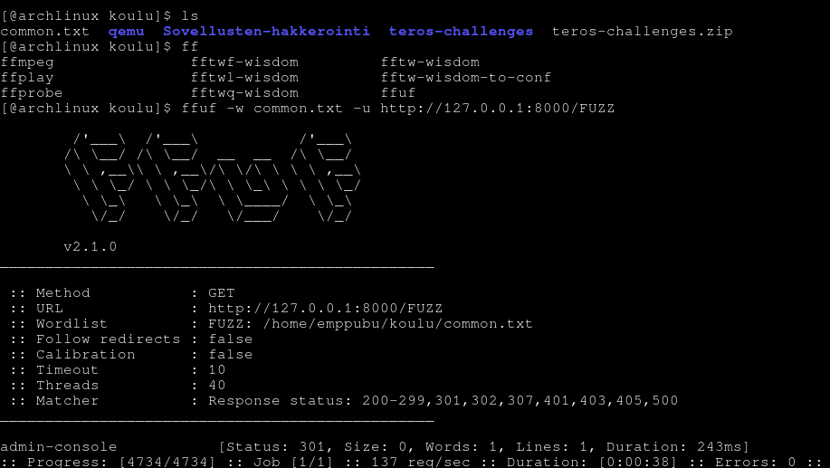
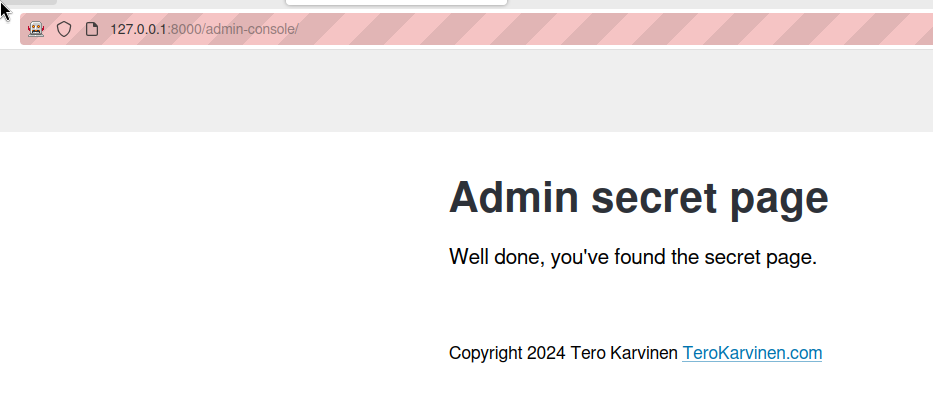
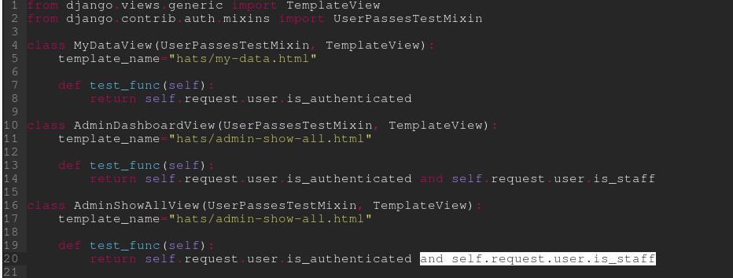

# Break & unbreak

## Ympäristö 

Käyttöjärjestelmä: Arch Linux x86_64

Prosessori: AMD Ryzen 5 2500U

Muisti: 8Gt.

## Lue/katso/kuuntele ja tiivistä.

### OWASP: OWASP Top 10

Käy läpi kymmenen OWASP:in luokkitelemaa yleisintä tietoturvariskiä läpi.

A01 Rikkinäinen pääsynvalvonta.

A02 Kryptograafiset virheet.

A03 Injektiot.

A04 Epäturvallinen suunnitelu.

A05 Tietoturvan väärin konfigurointi.

A06 Haavoittuvat ja päivittämättömät komponentit.

A07 Todennuksen epäonnistuminen.

A08 Tiedon eheyden epäonnistuminen.

A09 Turvallisuuden lokittamisen ja valvonnan epäonnistuminen.

A10 Palvelimen pyyntöjen väärentäminen.

### Karvinen 2023 - Find Hidden Web Directories

Etsi hakemistoja joita ei ole linkattu sivuilla, ohjelma käy sanalistan avulla hakemistot läpi siitä kohtaa mihin on kirjoitettu "FUZZ", esimerkiksi:

	ffuf -w wordlist.txt -u  http://127.0.0.1:8000/FUZZ

kävisi läpi sanalistasta(wordlist.txt) sivut joista tulee vastaus.

### PortSwigger - Access control vulnerabilities and privilege escalation

Kyky käyttäjälle tehdä asioita oikeuksien ulkopuolella, esimerkiksi päästä sivuille joihin ei ole oikeuksia tai muokata toisten käyttäjien tietoja ilman oikeuksia. 

### Karvinen 2006 - Raportin kirjoittaminen

Raportoi mitä teit, millä teit, merkitse lähteet. Raportit pitää olla toistettavia, jos on jotain vikaa niin raportoi myös mitä vikaa oli.

## Murtaudu 010-staff-only

(Tehty tunnilla)

Latasin ja purin tehtävät, asensin riippuvuudet komennolla ja käynnistin palvelun.

	sudo pacman -S python-flask python-flask-sqlalchemy; ./staff-only

Aluksi huomasin että rivi jolle kirjoitetaan pin koodi ei anna kirjoittaa muuta kuin numeroita, sen pystyi muuttamaan avaamalla inspect elementin ja poistamalla "numeric" kohdan pin koodin kentästä.

Kokeilin aluksi perus SQL injektion koodia että antaisi kaiken tiedon. 

	' OR 1=1;-- 

Mutta se palautti vain yhden tulosteen, tunnilla annetuista vinkeistä kokeilin LIMIT funktiota koodissa jolla pystyn pyytämään seuraavan tulosteen ja skippaamaan ensimmäisen joka ei ollut oikea vastaus.

	' OR 1=1 LIMIT 2, 1;-- 

Tällä komennolla sain ratkaistua tehtävän.

## Korjaa 010-staff-only haavoittuvuus lähdekoodista.

Korjasin SQL lausekkeen käyttämällä parametrisoitua SQL lauseketta(Finding and Fixing SQL Injection Vulnerabilities in Flask (Python) with StackHawk 2024)

Sen jälkeen testasin ratkaisua:

## Ratkaise dirfuzt-1 artikkelista Karvinen 2023

Latasin kohteen ja fuzzasin sen

	ffuf -w common.txt -u http://127.0.0.2:8000/FUZZ

Huomasin että palvelin antaa 200 vastauksen jokaiseen kohteeseen josta ei ole hyötyä minulle. Päätin filtteröidä koon mukaan -fs parametrilla.

	ffuf -w common.txt -fs 132 -u http://127.0.0.2:8000/FUZZ

Josta löysin ratkaisun.

## Murtaudu 020-your-eyes-only

(Aloitettu tunnilla)

Alkuun loin virtuaali ympäristön.

	python -m venv venv --system-site-packages

Otin virtuaali ympäristön käyttöön.

	source venv/bin/activate

Asensin riippuvuudet.

	pip install -r requirements.txt

Menin django palvelimen hakemistoon ja tein migraatiot ja käynnistin palvelimen.

	./manage makemigrations; ./manage migrate

	./manage runserver

Kokeilin alkuun SQL injektioita sekä käyttäjätunnusten luontia ja sen kautta IDOR:ia mutta en huomannut mitään erikoista jota voisin käyttää hyväksi.

Sen jälkeen asensin Fuzzerin(ffuf), AUR:ista yay:lla.

	yay ffuf

Fuzzasin kohteen ja löysin osoitteen admin-console. 

Yritin uudestaan SQL injektiota tuloksetta, sen jälkeen päädyin kokeilemaan tunnuksia jotka loin ja se antoi kirjautua sisään ilman virhettä ratkaistaen tehtävän.

## Korjaa 020-your-eyes-only haavoittuvuus.

Ratkaisuksi riitti että lisäsi tarkistuksen admin tunnuksille kun menee admin-console sivulle.

Tarkistin vielä että se toimi.

## Lähteet: 

OWASP. Top 10:2021. Luettavissa: [https://owasp.org/Top10/A01_2021-Broken_Access_Control/](https://owasp.org/Top10/A01_2021-Broken_Access_Control/). Luettu: 2.11.2024

PortSwigger. Luettavissa: [https://portswigger.net/web-security/access-control](https://portswigger.net/web-security/access-control). Luettu: 2.11.2024. 

Karvinen, T. 2006. Raportin kirjoittaminen. Luettavissa: [https://terokarvinen.com/2006/raportin-kirjoittaminen-4/](https://terokarvinen.com/2006/raportin-kirjoittaminen-4/). Luettu: 2.11.2024.

Venv https://docs.python.org/3/library/venv.html

Yay AUR pakettien asennukseen: https://github.com/Jguer/yay

AUR paketti ffuf:lle: https://aur.archlinux.org/packages/ffuf

Karvinen, T. 2023. Find Hidden Web Directories - Fuzz URLs with ffuf. Luettavissa: [https://terokarvinen.com/2023/fuzz-urls-find-hidden-directories/](https://terokarvinen.com/2023/fuzz-urls-find-hidden-directories/). Luettu: 2.11.2024.

Karvinen, T. 2024. Hack'n Fix. Luettavissa:[https://terokarvinen.com/hack-n-fix/](https://terokarvinen.com/hack-n-fix/). Luettu: 2.11.2024.

StackHawk 2024. Finding and Fixing SQL Injection Vulnerabilities in Flask (Python) with StackHawk. Luettavissa: [https://www.stackhawk.com/blog/finding-and-fixing-sql-injection-vulnerabilities-in-flask-python/](https://www.stackhawk.com/blog/finding-and-fixing-sql-injection-vulnerabilities-in-flask-python/). Luettu: 1.11.2024 Fiksi 01-staff-only
