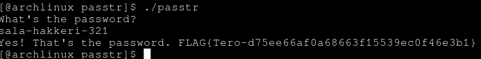
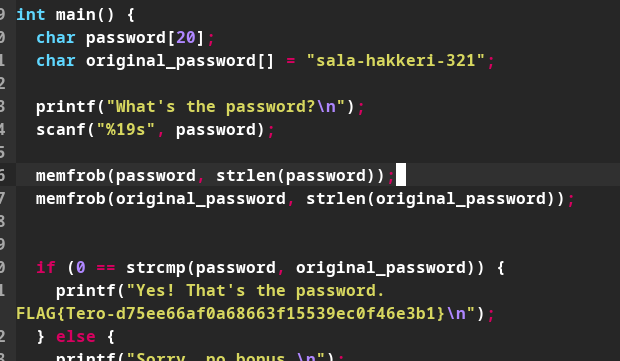
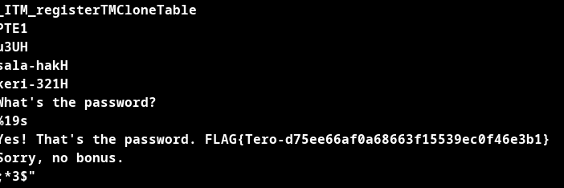
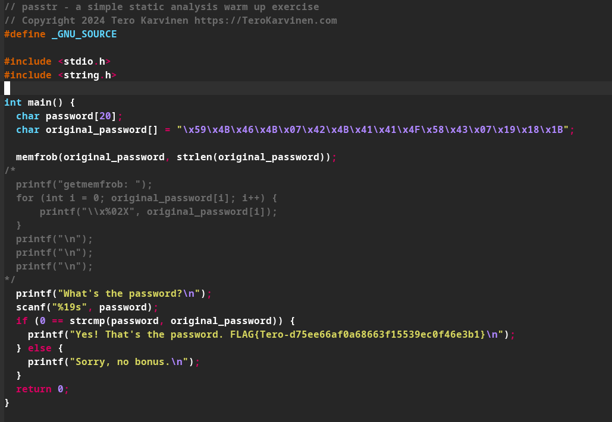
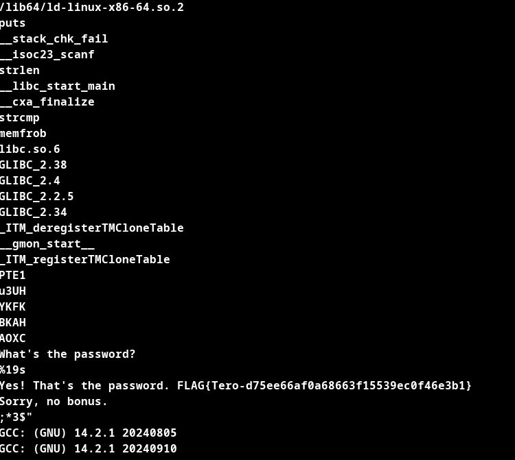
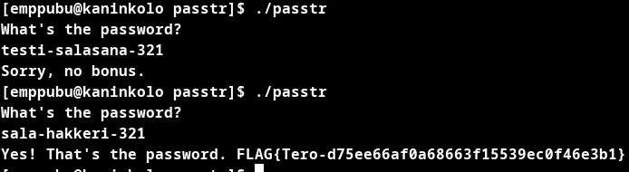
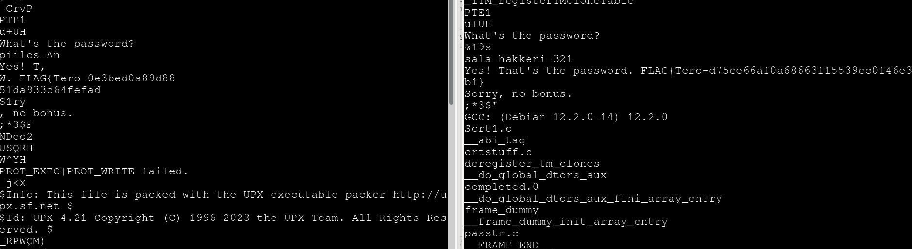
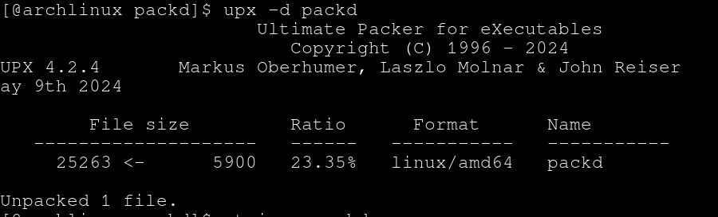
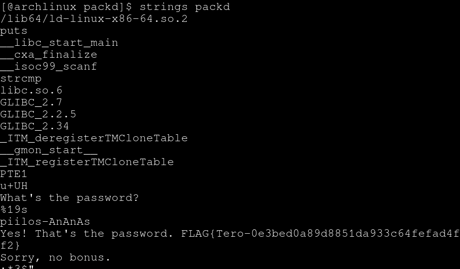
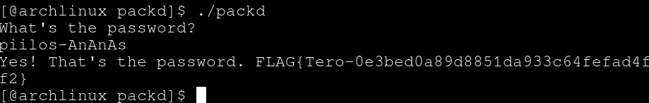

# No strings attached

## Ympäristö

Käyttöjärjestelmä: Arch Linux x86_64

Prosessori: AMD Ryzen 2500U

Muisti: 8Gt.

## Strings. Lataa ezbin-challenges.zip Aja 'passtr'. Selvitä oikea salasana 'strings' avulla. Selvitä myös lippu. 

Aloitin tehtävän purkamalla tehtävät, kokeilin aluksi ajamalla ohjelman, ohjelma toimi odotetusti mutta en tietänyt salasanaa.

	./passtr

Kokeilin strings ohjelmaa ja tulosteesta pystyin selvittämään salasanan

	strings passtr

Testasin vielä ratkaisua.

FLAG{Tero-d75ee66af0a68663f15539ec0f46e3b1}

## Tee passtr.c -ohjelmasta uusi versio, jossa salasana ei näy suoraan sellaisenaan binääristä. Osoita testillä, että salasana ei näy.

Lähdin etsimällä netistä tietoa obfuskoinnista ja löysin memfrob() funktion ja kokeilin sitä, sen lopputulos oli osittain obfuskoitu teksti mutta olisin pystynyt selvittämään salasanan kohtuu helposti silti strings:in avulla joten ryhdyin etsimään monimutkaisempaa ratkaisua. 

Päädyin ratkaisuun jossa olen generoinut salasanan memfrob:illa ennen kuin se on ajettu jolloin strings komennolla ei näe suoraan salasanaa tulosteesta, salasana generoidaan kommentoidussa osiossa olevalla koodilla siten että  original_password = "haluttu stringi" käännetään memfrobilla ja sen jälkeen kun ajaa ohjelman se tulostaa stringistä memfrobilla obfuskoidun pätkän jota pystyi käyttämään salasanana.

## Packd. Aja 'packd' paketista ezbin-challenges.zip. Mikä on salasana? Mikä on lippu?

Kokeilin aluksi strings kautta ja huomasin tulosteessa osittain luettavaa tekstiä, teksti vastasi osittain aiemman tehtävän tulosteita(kuvassa oikealla), lähdin sen kautta etsimään löytyisikö strings:in tulosteesta muuta jonka voisi yhdistää luomaan kokonaisen lauseen ja salasanan. 

	strings packd

En löytänyt mitään millä olisin loogisesti voinut luoda kokonaista lausetta tulosteesta, kokeilin myös Base64 dekoodausta osaan string:in tulosteista saaden vain sotkua(koska oli mainittu vinkeissä vaikkakin Cryptopals osiolle), lopulta huomiota herätti teksti jossa luki "$Info: This file is packed with the UPX executable packer http://upx.sf.net ", sen kautta päädyin UPX manuaali sivuille josta löytyi komento jolla pystyi purkamaan pakkauksen. Asensin upx:n ja ajoin komennon.

	sudo pacman -S upx

	upx -d packd

Sen jälkeen ajoin strings komennon uudestaan ja löysin salasanan.

Testasin vielä että salasana toimii.

FLAG{Tero-0e3bed0a89d8851da933c64fefad4ff2}

En tiedä oliko tämä haluttu tapa ratkaista tehtävä koska ensimmäisessä tehtävässä oli erikseen mainittu strings ohjelma.

## Lisätehtävät:

todo

## Lähteet:

Karvinen, T. 2024. Sovellusten hakkerointi ja haavoittuvuudet. Luettavissa: [https://terokarvinen.com/application-hacking/](https://terokarvinen.com/application-hacking/). 

UPX(1) manuaali. Luettavissa: 

	man upx

Reddit. How can I obfuscate string constants? Luettavissa: [https://old.reddit.com/r/C_Programming/comments/q7m71i/how_can_i_obfuscate_string_constants/](https://old.reddit.com/r/C_Programming/comments/q7m71i/how_can_i_obfuscate_string_constants/).  Ensimmäinen kommentti

Xor encryption in C programming. Katsottavissa: [https://www.youtube.com/watch?v=kslkAX6frFE](https://www.youtube.com/watch?v=kslkAX6frFE). Apuna b) tehtävään.

How to define hex character array in C? Luettavissa: [https://www.linuxquestions.org/questions/programming-9/how-to-define-hex-character-array-in-c-668213/](https://www.linuxquestions.org/questions/programming-9/how-to-define-hex-character-array-in-c-668213/).
