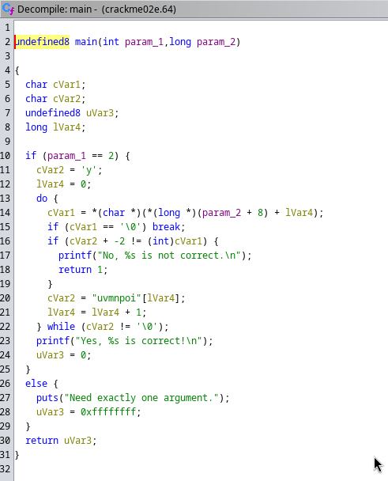

# Kääntöpaikka

## Ympäristö

Käyttöjärjestelmä: Arch Linux x86_64

Prosessori: Ryzen 2500U

Muisti: 8Gt.

## Lue/katso/kuuntele ja tiivistä.

### Hammond 2022

## Asenna Ghidra

Asensin Ghidran suoraan arch:in pakettienhallinnasta.

	sudo pacman -S ghidra

## rever-C. Käänteismallinna packd-binääri C-kielelle Ghidralla. Etsi pääohjelma. Anna muuttujielle kuvaavat nimet. Selitä ohjelman toiminta. Ratkaise tehtävä binääristä, ilman alkuperäistä lähdekoodia.

Aloitin tehtävän kopioimalla packd ohjelman ja annoin sen nimeksi pack-unpack ja otin sen  pois pakatusta muodosta.

	cp packd pack-unpack

	upx -d pack-unpack

Aloitin uuden projektin Ghidrassa ja lisäsin pakkaamattoman packd(pack-unpack) tiedoston projektiin, avasin ohjelman Ghidrassa tuplaklikkaamalla ohjelmaa joka oli lisätty projektiin.

Analysoin paketin ja avasin "main" funktion Symbol tree listasta 

Lähdin nimeämään muuttujille nimiä

Ohjelma ottaa käyttäjän syötteen(user_input) ja vertaa(compare) sitä salasana "piilos-AnAnAs" string:iin jos käyttäjän syöte on identtinen salasanan kanssa compare arvoksi tulee 0, jos compare arvo on 0 tulostetaan "Yes! That\'s the password. FLAG{Tero-0e3bed0a89d8851da933c64fefad4ff2}" ja jos jokin muu niin "Sorry, no bonus.", sen jälkeen ohjelma palauttaa 0 ja sulkeutuu.

## Jos väärinpäin. Muokkaa passtr-ohjelman binääriä (ilman alkuperäistä lähdekoodia) niin, että se hyväksyy kaikki salasanat paitsi oikean. Osoita testein, että ohjelma toimii. 

Lisäsin passtr ohjelman Ghidraan, avasin sen tuplaklikkaamalla, analysoin sen ja valitsin main funktion.
 

Valitsin dekompiloidusta osion joka katsoo onko iVar1 muuttuja 0, se hyppää Assembly koodissa osioon jossa käsitellään sitä, JNZ (Jump Non-Zero?) kohtaan.

Muutan JNZ:n pelkäksi JZ:ksi, oikea klikki ja patch instruction(CTRL+SHIFT+G)

Eron pystyy nähdä jo dekompiloidusta C koodista, mutta muutan ohjelman vielä ajettavaksi ohjelmaksi File>Export Program ja valitsen formaatiksi Original Format. Annan ohjelmalle vielä ajo oikeudet.

	chmod +x passtr-ghidra

Testasin vielä ratkaisua. 

## Nora CrackMe: Käännä binääreiksi Tindall 2023: NoraCodes / crackmes. Lue README.md: älä katso lähdekoodeja, ellet tarvitse niitä apupyöriksi. Näissä tehtävissä binäärejä käänteismallinnetaan. Binäärejä ei muokata, koska muutenhan jokaisen tehtävän ratkaisu olisi vaihtaa palautusarvoksi "return 0"

Aloitin kloonaamalla git repon ja kääntämällä koodit.

	git clone git@github.com:NoraCodes/crackmes.git;

	cd crackmes/;

	make

## Nora crackme01. Ratkaise binääri

Annoin ohjelmalle ajo oikeudet ja testasin toimiiko ohjelma.

	chmod +x crackme01.64

	./crackme01.64

Törmäsin sattumalta oikeaan salasanaan mutta lähdin tekemään tehtävää oletettavasti halutulla tavalla.

Lisäsin ohjelman Ghidraan, avasin sen, analysoin ja valitsin main funktion.

Pystyn lukemaan C koodista salasanan "password1", "iVar1 = strncmp(__s1,"password1",9);"

## Nora crackme01e. Ratkaise binääri

Annoin ohjelmalle ajo oikeudet ja testasin toimiiko ohjelma.

	chmod +x crackme01e.64

	./crackme01e.64

Sen jälkeen tein saman mitä tein aiemmalle ohjelmalle eli isäsin ohjelman Ghidraan, avasin sen, analysoin ja valitsin main funktion.

Huomiota herätti rivi jossa luki: "iVar1 = strncmp(__s1,"slm!paas.k",10);" testasin oliko "slm!paas.k" salasana.

Salasana ei toiminut, kokeilin lainausmerkeissä ja sekään ei toiminut, mutta heittomerkein se toimi.

## Nora crackme02. Nimeä pääohjelman muuttujat käänteismallinnetusta binääristä ja selitä ohjelman toiminta. Ratkaise binääri

Annoin ohjelmalle ajo oikeudet ja testasin toimiiko ohjelma.

	chmod +x crackme02.64

	./crackme02.64

Sen jälkeen tein saman mitä tein aiemmalle ohjelmalle eli isäsin ohjelman Ghidraan, avasin sen, analysoin ja valitsin main funktion. Nimesin muuttujat hetken pähkäilyn jälkeen.

Huomiota herätti "if (user_input == '\0') break;" eli break null-terminate merkistä.

Kokeilin laittaa tyhjää monella tavalla ja sain toimimaan 

Ohjelma toimii siten että se odottaa käyttäjältä vähintään yhtä argumenttia tai tulostaa "Need exactly one argument.", alkuun asettaa salasanaksi pelkän "p" ja i eli indeksin alkamaan 0:sta eli ensimmäisestä kirjaimesta. Sen jälkeen alkaa do while looppi jossa otetaan käyttäjän syöte eli user_input indeksin mukainen merkki. Jos expected_character + -1 ei ole sama kuin käyttäjän syötteen indeksin mukainen merkki integer muodossa(ASCII?) tulostetaan "No, %s is not correct.\n" ja poistutaan ohjelmasta, jos se taas on sen mukainen merkki jatketaa while looppia jossa otetaan "password1" seuraavan indeksin mukainen merkki[i+1] eli "a" ja vielä lisätään indeksiin +1. Looppia käydään niin kauan kunnes jokin odotetuista merkeistä ei täsmää käyttäjän syötteen kanssa tai jos odotettu merkki on null-terminated merkki eli password1 jälkeinen merkki jonka jälkeen saadaan ratkaisu.

## Crackme02 on kaksi ratkaisua. Löydätkö molemmat?

Sain idean kun kirjoitin ohjelman toiminnosta koittaa vielä kolmatta(vaikkakin kaksi ensimmäistä toimi samalla logiikalla) keinoa jossa muutan password1 ascii:ksi ja vähennän 1 jokaisesta kirjaimesta.

Testasin vielä ratkaisua:

En olisi saanut ratkaistua ellen olisi kirjoittanut ohjelmiston toiminnasta ja huomannut että verrataan integeriin.

## Crackme01 on useampia ratkaisuja. Montako löydät? Miksi?

Huomasin että strcmp katsoo ainoastaa 9 ensimmäistä merkkiä jolloin salasanaksi käy kaikki salasanat jotka alkavat "password1"

##  Nora crackme02e. Ratkaise binääri

Ohjelma toimii samalla logiikalla kuin Crackme02 paitsi että vähennetään 2 ja cVar2 ei oteta indeksin seuraavaa automaattisesti koska ensimmäinen kirjain eroaa jo seuraavasta, lähdin muuttamaan "yuvmnpoi" ASCII:ksi ja vähensin jokaisesta merkistä 2.

Testasin vielä ratkaisuja:

## Lähteet:

Hammond, J. 2022. GHIDRA for Reverse Engineering (PicoCTF 2022 #42 'bbbloat') Katsottavissa: https://www.youtube.com/watch?v=oTD_ki86c9I Katsottu:

Karvinen, T. Sovellusten hakkerointi ja haavoittuvuudet. Luettavissa: https://terokarvinen.com/application-hacking/

ASCII muunnin: https://www.unit-conversion.info/texttools/ascii/

Tindall 2023. Nora Crackme. Tehtävät: https://github.com/NoraCodes/crackmes
