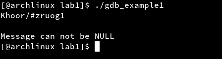
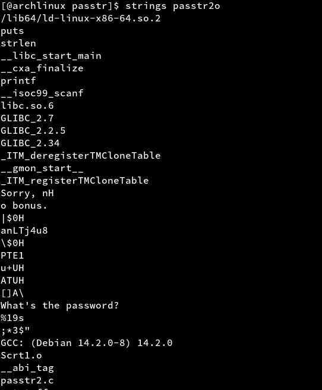

## H5

Asensin GDB Dashboardin 

	sudo pacman -S gdb

Asensin myös GDB dashboardin jolla pystyn muokkaamaan näkymää helpommin.

Latasin lab1.zip, lab2.zip, lab3.zip ja purin ne.

## Lab1. Tutkiminen mikä on ohjelmassa vialla ja miten se korjataan.

Aloitin tehtävän ajamalla ohjelman ja huomaan että tulee virhe kun sen ajaa.

Ohjelman on tarkoitus tulostaa merkkejä i muuttujan lisäämällä eli tässä tapauksessa 3:lla lisätään numeroita ASCII taulukossa.

Lisäsin if lausekkeen joka katsoo onko viesti tyhjä ja return 0 jos ohjelma menee läpi, testasin myös ratkaisua. 

## Lab2. Selvitä salasana ja lippu + kirjoita raportti siitä miten aukesi.

Kokeilin ajaa ohjelmat, passtr on ilmeisesti aiempi binääri joka on jo tehty.

passtr2o en tiennyt salasanaa joten lähdin sitä tekemään, katsoin aluksi strings ohjelmalla mutta se ei paljastanut mitään kovin mielenkiintoista, pistin kuitenkin mieleen rivin jossa luki "anLTj4u8"

Avasin ohjelman gdb:llä ja asetin breakpointin main:iin

	gdb 

	break main

	r

Huomaan assembly xor liittyvää.

Liikun eteenpäin koodissa nexti:llä eli siirryn aina yhden rivin kerrallaan assembly koodissa.

	nexti

Huomaan että se käy läpi useamman useamman kerran "rep movsl %ds:(%rsi),%es:(%rdi)" kohdan. Ilmeisesti liittyi tämän tulostamiseen:

	>>> x/2fs $rdi
	0x555555556004:	"What's the password?"
	0x555555556019:	"%19s"
	

Ajan ohjelman kerran läpi kokonaan ja pistän muistiin missä kohdissa muistin rekisterit muuttuu(Tässä auttoi huomattavasti dashboard lisäri gdb:hen). Huomaan että XOR:rataan %eax, %eax:llä? 

Lisään uuden breakpointin "mAsdf3a" ja "EaseEAs", huomaan etten törmää "EaseEAs" kertaakaan? Veikkaan että sillä dekoodaataan lippu. 

Huomaan $rsp rekisterissä on "anLTj4u8" sen jälkeen kun on kysytty salasana jonka löysin jo strings:illä, veikkaan että tästä dekoodaataan oikea salasana jota verrataan käyttäjän syötteeseen.

Ajan ohjelmaa eteenpäin kunnes päädyn "mAsdf3a" funktioon, siellä huomaan että kutsutaan "call   0x555555555040 <strlen@plt>", veikkaan että otetaan pituus?

Myöhemmin samassa funktiossa on "JNE" eli Jump Not Equal, se hyppää eteenpäin koska oletettavasti salasanojen pituudet eivät ole samoja?

Kokeilen uudestaan 8 merkkiä pitkällä salasanalla "salasana", pääsen JNE:stä eteenpäin joten oletan että aiempi hypoteesi piti paikkaansa jossa otetaan annetun salasanan ja oikean salasanan pituus.

Huomaan että lisätään 3 ja vähennetään 7.

Menen eteenpäin ja huomaan että se hyppää ohi vähennyksen.

Ajan ohjelman loppuun ja uudestaan tällä kertaa anna salasanaksi "dalasana" koska "a" + 3 ascii taulukossa muuttuu "d":ksi, ja huomaan että tällä kertaa ohjelma ajaa vähennys kohtaan saakka. Päättelen tästä että joka toinen kirjain vähennetään ja joka toinen lisää.

Muutan "anLTj4u8" ascii:ksi ja lähden yrittämään hypoteesia

	What's the password?
	dgOMm-x1
	Yes! That's the password. FLAG{Lari-rsvRDx04WMBZpuwg4qfYwzdcvVa0oym}

## Lab3. Kokeile Nora Crackmes harjoituksia tehtävä 3 ja 4 j

## Lähteet:

https://github.com/cyrus-and/gdb-dashboard

https://github.com/cyrus-and/gdb-dashboard/issues/131
