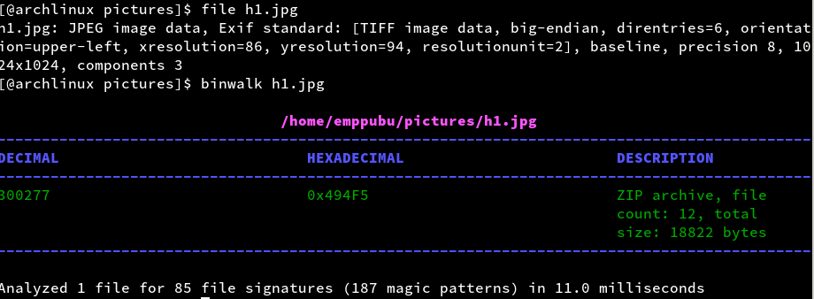
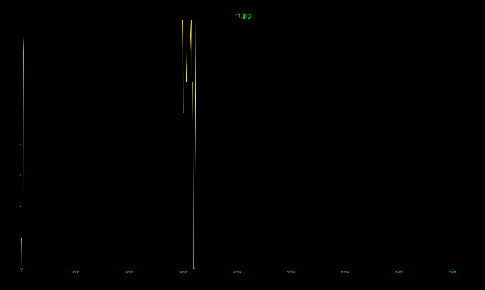
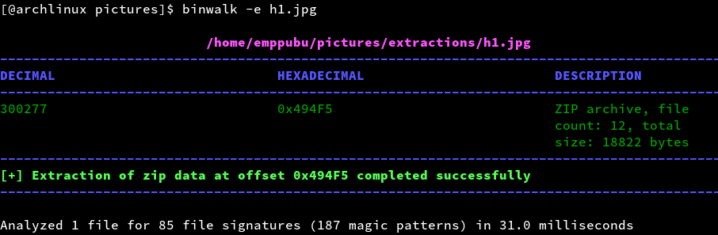
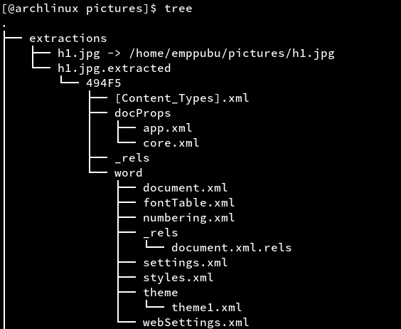
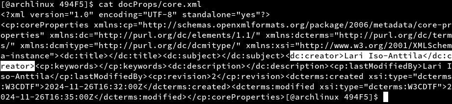
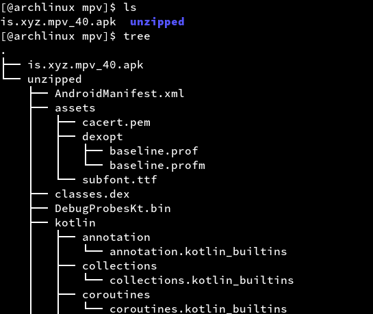
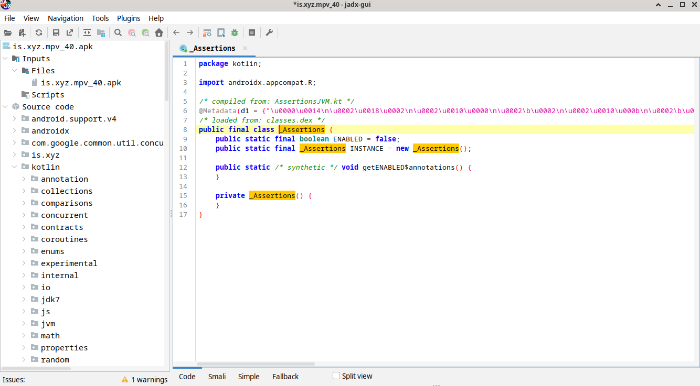
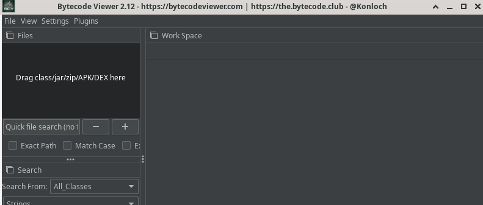
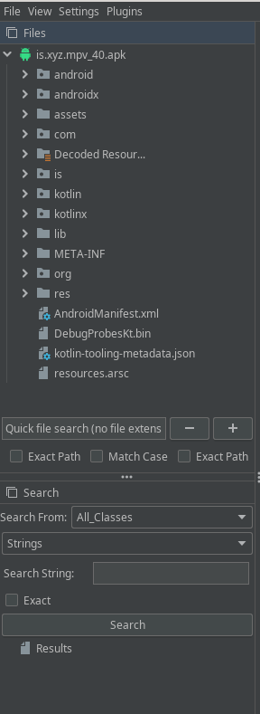

# H6 Sulaa hulluutta

## Ympäristö

Käyttojärjestelmä: Arch Linux x86_64

Prosessori: AMD Ryzen 2500U

Muisti: 8Gt.

## Tutki tiedostoa h1.jpg jo opituilla työkaluilla. Mitä saat selville?

Latasin h1.jpg tiedoston, en oikein muistanut mitä kaikkia työkaluja tunnilla käytiin enkä löytänyt kalvoja Moodlesta tämä hankaloitti tehtävän tekemistä, joten asensin Binwalk:in ZIP, Bytecode-viewer, JADX jotka mainitaan tehtävänannossa. Bytecode vieweriä ei löytynyt Archin pakettilistoilta joten katson sen asennuksen myöhemmin

	sudo pacman -S binwalk zip jadx

Kokeilin alkuun file ohjelmalla ja binwalk:illa

Binwalk paljastaa minulle että tiedostossa on jotain muutakin kuin pelkkä kuva.

## Tutki tiedostoa h1.jpg binwalk:lla. Mitä tietoja löydät nyt tiedostosta? Mitä työkalua käyttäisit tiedostojen erottamiseen? 

Generoin Binwalk:illa tiedoston entropiaa kuvaavan kaavion

	binwalk -E h1.jpg

Huomaan että keskellä tiedostoa entropia eroaa muusta, mutta en ole niin tutustunut tämän kaltaisiin kaavioihin että pystyisin sanomaan mitä miksi se eroaa? Arvuuttelen kuitenkin että se liittyy siihen että kuvaan on liitetty toinen tiedosto. Tässä vaiheessa jäin jumiin kun en tiennyt miten edetä, Binwalkin manuaali tosin antoi vinkin että sillä voisi purkaa tiedostoja joten kokeilin sitä.

	binwalk -e h1.jpg

Se onnistui purkamaan h1.jpg tiedoston extractions kansioon, sieltä löytyi huomattavsti xml tiedostoja.

XML tiedostot vaikuttavat liittyvän artikkeleihin, "core.xml" tiedostosta löytyi tietoa joka liittyy että tiedoston olisi luonut "Lari Iso-Anttila" joten oletan että tehtävä on suoritettu tässä vaiheessa?

## FOSS (Free Android OpenSource). Tutustu Android-sovelluksiin Offan (2024) listalta: Android FOSS. Valitse listalla itsellesi mielenkiintoisin applikaatio ja mene sen GitHubiin. Lataa ohjelman APK itsellesi ja käytä seuraavia työkaluja tutustuaksesi, miten APK:n voi avata.

Latasin MPV mediaplayer:in koska käytän sitä itse. Latasin APK tiedoston(is.xyz.mpv_40.apk) F-Droidin sivuilta. 

### ZIP

Loin uuden kansion ja poistin APK paketista

	unzip is.xyz.mpv_40.apk -d unzipped/

Tiedosto purkaantui hyvin unzipped kansioon

### JADX

Avasin jadx GUI version.

	jadx-gui

Siellä pystyi valita APK tiedoston, sillä pystyi lukemaan koodia ja nähdä ohjelman tiedostoja.

### Bytecode-viewer

Asensin Bytecode viewerin githubista ja avasin sen.

Vedin APK tiedoston ohjelmaan ja pääsin taas sen sisältöihin käsiksi.

## Lähteet:

Karvinen. Sovellusten hakkerointi ja haavoittuvuudet. Luettavissa: https://terokarvinen.com/application-hacking/

Binwalk man sivut.

Github. Bytecode viewer. https://github.com/Konloch/bytecode-viewer/

Github. Mpv-android. https://github.com/mpv-android/mpv-android
