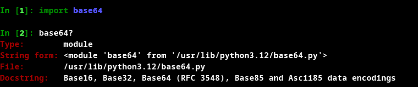
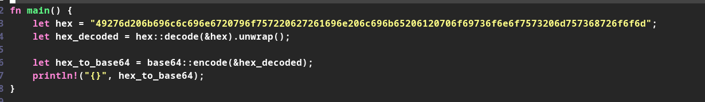
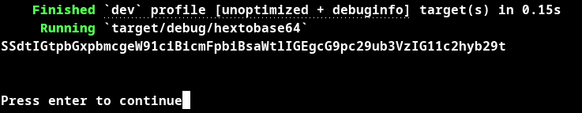
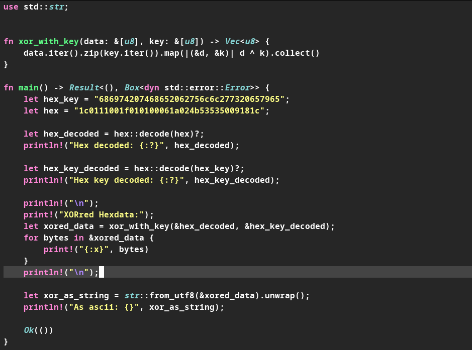
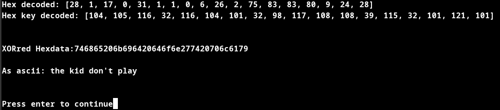
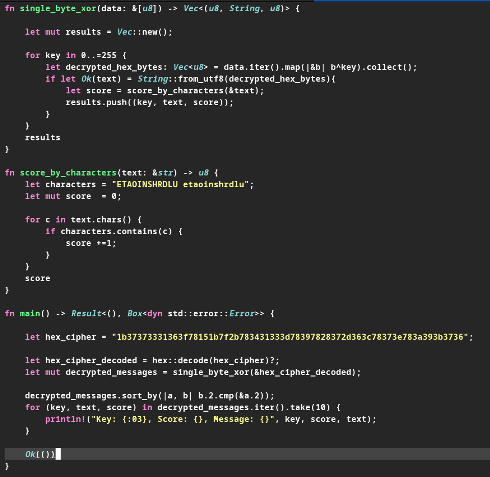
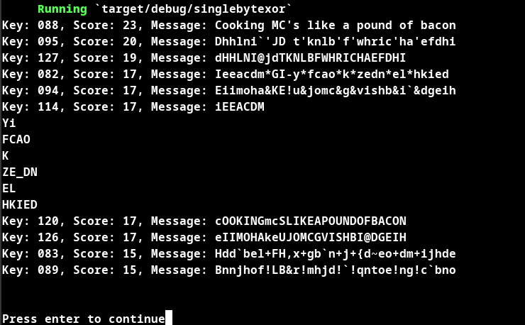
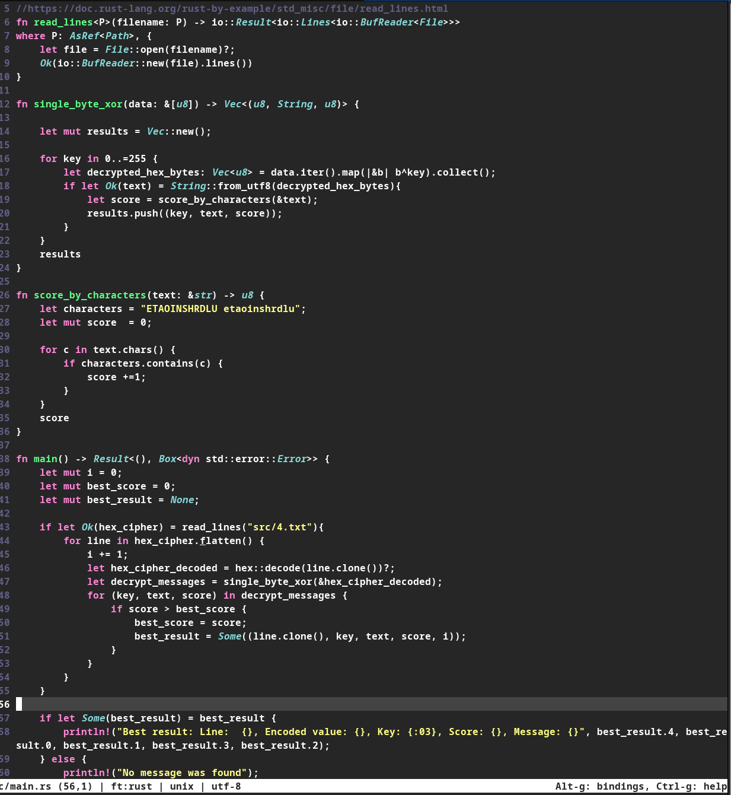
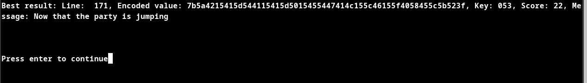

# H7 Uhagre2

## Lue/katso/kuuntele ja tiivistä

### Schneier 2015: Applied Cryptography, 20ed

#### 1.1 Terminology ("Historical Terms" loppuun)

Viestit ja enkryptaus, tarkoitus piilottaa viestin sisältö jotta kukaan ei välissä pysty lukemaan sitä.

Yksinkertaisuudessaan kaava menee mallilla eli E on enkryptaus, D on dekryptaus, C on cipher ja M on viesti.

E(M) = C

D(C) = M

Eli käyttäjä enkryptaa viestin ja saaja dekryptaa cipherista viestin.

Avaimiin perustuvassa salauksessa viestri salataan avaimella ja salaus poistetaan avaimella, avainpari ensimmäisellä avaimella salataan ja toisella poistetaan salaus.

#### 1.4 Simple XOR

Salaus toimii että avaimella XOR:rataan bitit ja samalla avaimella saadaan bitit alkuperäiseen muotoon

A^A = A

A^B=B

B^A=B

B^B=A

#### 1.7 Large Numbers

Taulukko isoista luvuista ja todennäköisyyksistä. 

### Karvinen 2024: Python Basics for Hackers

Ohje pythonin käytöstä työkaluna häkkeröintii!

Esimerkiksi IPythonin käytöstä antaa helpon tavan kokeilla koodia interaktiivisen tulkin avulla!

## Ratkaise CryptoPals Set 1 -haasteet. Tehtävät saa ratkaista millä vain ohjelmointikielellä ja käyttää mitä tahansa tekstieditoria tai IDE:ä. 

Olin jo ratkaissut tehtävät aiemmin Pythonilla joten lähdin tekemään niitä itselle osittain uudella kielellä Rust:illa [ystäväni](https://github.com/xy137) ehdotuksesta. 

### 1. Convert hex to base64.

Otin viestin pois heksadesimaalimuodosta ja sen jälkeen enkoodasin sen base64:llä

Riippuvuudet: Hex ja Base64

### 2. Fixed XOR.

Eli alkuun otetaan hex ja hex_key pois heksadesimaalimuodosta syötetään xor_with_key funktioon hex_decoded ja hex_key_decoded tavut(u8) joka käy ne iteroiden läpi ja XOR:rraa ja palauttaa sen vektori janana Vec`<u8>`,  jossa yksi osio on tavun mittainen.

Jälkikäteen katsottuna olisi voinut huomattavasti helpommin päästä samaan lopputulokseen jos olisin katsonut datan vaan stringinä mutta Cryptopalsin ohjeistuksessa neuvotaan "Always operate on raw bytes, never on encoded strings. Only use hex and base64 for pretty-printing. " Google onnistui myös spoilaamaan minulle ratkaisun mutta yritin tehdä omalla tavalla.

### 3. Single-byte XOR cipher.

Otetaan hex_cipher pois heksadesimaalista ja ajetaaan se single_byte_xor  funktioon jossa XOR:rataan ja katsotaan onko tulos validia UTF-8  merkistöön sopivaa tekstiä jos on niin ajetaan pisteytys funktioon jossa saa pisteen jokaisesta merkistä joka täsmää characters muuttujan merkkiin. Sen jälkeen kun kaikilla tavuilla on yritetty single_byte_xor palauttaa vektorin joka koostuu avaimesta, dekoodatusta tekstistä ja pisteistä.  Sen jälkeen järjestetään pisteiden mukaan ja tulostetaan 10 eniten pisteitä saaneita merkkijonoja.

### 4. Detect single-character XOR.

Latasin tiedoston cryptopals sivustolta, pystyin käyttämään koodissa pohjana edellisen tehtävän koodia lisäsin siihen funktion joka joka lukee jokaisen rivin ja käy loopissa dekoodaten hex_cipherin XOR:raten ja  sitten vertaus tuloksestas joka tallentaa tuloksen best_result muuttujaan, lopussa on tarkistus(Some) että best_result muuttujassa on sisältöä ja sen jälkeen tulostetaan sisältö.

## Lähteet

https://www.oreilly.com/library/view/applied-cryptography-protocols/9781119096726/08_chap01.html#chap01-sec001

https://terokarvinen.com/python-for-hackers/

https://github.com/xy137

https://stackoverflow.com/questions/51584729/how-can-i-store-multiple-elements-in-a-rust-hashmap-for-the-same-key

https://doc.rust-lang.org/rust-by-example/std_misc/file/read_lines.html